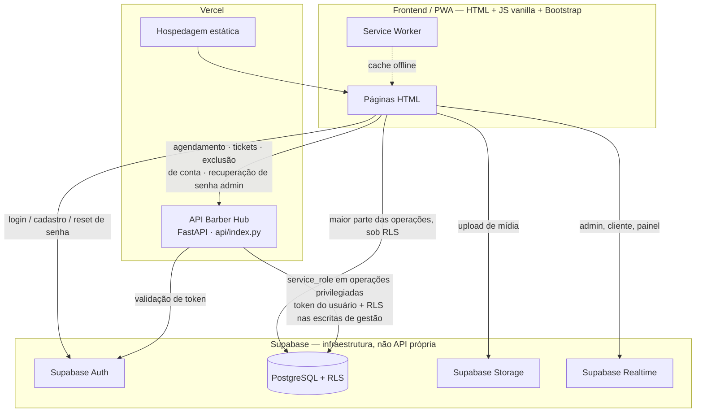
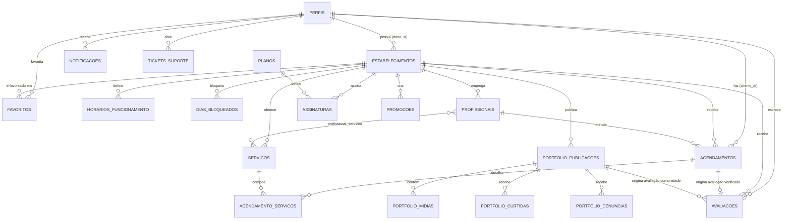

# PRD — Barber Hub
### Product Requirements Document

> Documento gerado a partir da leitura direta do código-fonte do repositório `Barber-Hub-Oficial-main` (não a partir de suposições ou apenas da documentação existente). Toda afirmação de status foi confirmada em código; onde isso não foi possível, o item está marcado como **não confirmado**.

**Legenda de status usada neste documento:**

| Status | Significado |
|---|---|
| ✅ IMPLEMENTADO | Existe e funciona no código analisado, ponta a ponta (UI + regra de negócio + persistência) |
| 🟡 IMPLEMENTADO PARCIALMENTE | Existe código real, mas incompleto, inconsistente, não conectado de ponta a ponta, ou com lacunas conhecidas |
| 🔵 PLANEJADO | Há evidência de intenção (schema preparado, campo reservado, comentário, doc de decisão) mas sem funcionalidade utilizável |
| ⚪ FORA DO ESCOPO ATUAL | Mencionado no briefing do produto, mas sem qualquer rastro no repositório |
| ❓ NÃO CONFIRMADO | Não foi possível verificar com segurança no código disponível |

---

## 1. Identificação do produto

| Campo | Valor |
|---|---|
| Nome | Barber Hub |
| Categoria | Marketplace digital de serviços (descoberta + agendamento) com SaaS de gestão embutido para o lado da oferta |
| Vertical | Barbearias, com expansão de posicionamento em andamento para "negócios de beleza" em geral (ver `html/beauty-hub.html`, descrição do `manifest.webmanifest`: *"Encontre barbearias, agende serviços e gerencie seu negócio em um só lugar"*) |
| Tipo de produto | Aplicação web + interface HTML mobile dedicada, instalável como PWA, multi-tenant (múltiplos estabelecimentos independentes), com backend próprio (API Python/FastAPI) sobre infraestrutura Supabase |
| Empresa/divisão | The Gamers Tech |
| Estágio atual | Produto em produção ativa (deploy Vercel), evoluindo por versões incrementais e documentadas (1.1 → 1.6). Não há, no repositório, uma declaração formal de "MVP concluído" — ver critério proposto na Seção 22 |
| Versão analisada | Front-end/PWA **1.6.0** (`package.json`, cache do Service Worker `barberhub-v1.6.0`) · API própria **1.2.0** (`pyproject.toml`, `api/index.py`) · Schema de banco até a migration **15** (`15_marketplace_fts_api_seguranca.sql`) |
| Repositório analisado | `Barber-Hub-Oficial-main.zip`, domínio de referência `barberhuboficial.vercel.app` |
| Stack confirmada em código | HTML/CSS/JS vanilla + Bootstrap 5.3.6 (local, em camada `@layer`); Supabase (PostgreSQL, Auth, Storage, RLS, Realtime); backend próprio em Python 3.13+/FastAPI 0.117+/Pydantic 2.10+, empacotado como função serverless da Vercel (`api/index.py`); PWA com Service Worker e manifest próprios |

---

## 2. Resumo executivo

O Barber Hub é uma plataforma que une, em um único produto, duas necessidades que hoje costumam ser resolvidas com ferramentas separadas: a **descoberta e o agendamento de serviços de barbearia** (do ponto de vista do cliente) e a **gestão operacional do negócio** (do ponto de vista do estabelecimento).

Do lado da demanda, um cliente cria conta, encontra estabelecimentos por localização e serviço, vê se estão abertos agora, confere preços, profissionais, portfólio e avaliações (verificadas e da comunidade), monta um agendamento com um ou mais serviços, escolhe profissional/data/horário e acompanha o status do atendimento — recebendo notificações no caminho.

Do lado da oferta, um barbeiro independente ou proprietário de barbearia cria seu estabelecimento por um onboarding guiado, cadastra serviços e profissionais, define horários de funcionamento, controla manualmente se está "Aberto"/"Fechado" independentemente do horário programado, administra a agenda recebida, publica portfólio (com moderação), responde avaliações e acompanha indicadores do próprio negócio — tudo em um painel próprio.

Uma área administrativa da plataforma (The Gamers Tech) supervisiona usuários, estabelecimentos, avaliações, denúncias de conteúdo e tickets de suporte.

Arquiteturalmente, o produto continua em migração deliberada de regras sensíveis para uma API própria em Python/FastAPI. Na versão 1.6, além de criação de agendamento, tickets, exclusão de conta e recuperação administrativa, a API já concentra busca/ranking do marketplace, cancelamento e transições de status de agendamento, overview/health administrativo, rate limiting e logs mínimos. Leituras simples e parte do CRUD operacional ainda acessam o Supabase diretamente sob RLS; portanto a transição **segue em andamento, mas a linha transacional principal está significativamente mais centralizada** (ver Seções 14, 15 e 29).

---

## 3. Problema

**Para clientes**
- Dificuldade de descobrir barbearias por perto com informação confiável de preço, serviço e disponibilidade antes de sair de casa ou mandar mensagem.
- Não há como saber, à distância, se o estabelecimento está de fato aberto no momento (horário "de tabela" nem sempre reflete a realidade).
- Agendamento hoje depende tipicamente de ligação ou WhatsApp, sem confirmação estruturada, sem histórico e sem lembrete automático.
- Dificuldade de avaliar a qualidade de um estabelecimento antes de ir, com avaliações confiáveis (e não apenas estrelas genéricas sem relação com um atendimento real).

**Para barbeiros independentes**
- Sem uma vitrine digital própria, dependem de redes sociais (Instagram/TikTok) para divulgação e de conversas manuais para agendar, sem uma agenda centralizada.
- Sem histórico estruturado de clientes, serviços mais procurados ou horários de pico.

**Para proprietários de barbearia**
- Gestão de equipe, serviços e horários costuma ser manual (papel, planilha, agenda física ou grupos de WhatsApp), com risco de conflito de horário e retrabalho.
- Falta de visão consolidada de indicadores do negócio (quantos agendamentos, quais serviços performam melhor, reputação).
- Reputação online fragmentada entre redes sociais e boca a boca, sem um canal único e verificável.

**Para profissionais (equipe de um estabelecimento)**
- No modelo atual do produto, um profissional de equipe é um **registro cadastrado pelo dono do estabelecimento** (tabela `profissionais`), não uma conta de usuário independente — ou seja, hoje a equipe **não tem login próprio** para consultar sua própria agenda sem passar pelo dono. Esse é um problema real para barbearias com mais de um profissional que o produto ainda não resolve (ver Seção 27, Decisões abertas).

---

## 4. Proposta de valor

A proposta central é eliminar a fragmentação entre **ferramenta de divulgação** (redes sociais), **ferramenta de agendamento** (WhatsApp/telefone) e **ferramenta de gestão** (papel/planilha), substituindo as três por um único ecossistema onde:

- o cliente que descobre o estabelecimento já agenda no mesmo lugar, sem trocar de canal;
- o agendamento gerado no marketplace já cai direto na agenda operacional do estabelecimento, sem digitação manual;
- a reputação (avaliações verificadas por atendimento real + avaliações da comunidade) é nativa da plataforma, não depende de terceiros;
- o dono do negócio ganha, de graça, uma presença digital pesquisável, e paga (potencialmente, via planos — Seção 20) por recursos de gestão mais avançados.

Esse encadeamento (descoberta → agendamento → execução → avaliação → indicadores) só é possível porque marketplace e SaaS de gestão compartilham o mesmo banco de dados e as mesmas regras de negócio — um agendamento feito pelo cliente é, ao mesmo tempo, o item de agenda do profissional.

---

## 5. Público-alvo (personas)

**1. Cliente final**
Pessoa que busca um corte, barba ou serviço de estética masculina/beleza. Quer decidir rápido: perto, aberto agora, preço visível, avaliação confiável. Prioriza celular.

**2. Barbeiro independente**
Profissional autônomo, geralmente sem funcionários, que hoje usa Instagram/WhatsApp para tudo. Quer presença digital própria e agenda organizada sem complexidade de "sistema empresarial". No produto atual, ele se cadastra como `barbeiro`/dono e pode operar seu próprio estabelecimento sozinho (não precisa cadastrar profissionais adicionais).

**3. Proprietário de barbearia (com equipe)**
Responsável pelo negócio como um todo: cadastra profissionais, serviços, horários; acompanha indicadores; modera portfólio; responde avaliações. É o único perfil com acesso ao painel (`painel.html`) do estabelecimento no modelo atual.

**4. Equipe/profissional (colaborador)**
Pessoa que atende, mas hoje é representada apenas como **dado cadastral** dentro do estabelecimento (nome, especialidade, serviços que executa, ativo/inativo), sem login próprio nem visão da própria agenda de forma independente do dono — uma lacuna relevante desta persona.

**5. Administrador da plataforma**
Time da The Gamers Tech responsável por moderar conteúdo (avaliações, denúncias de portfólio), gerenciar usuários e estabelecimentos (ativar/desativar, verificar, destacar), atender tickets de suporte e (via API própria) executar ações sensíveis como recuperação de senha de terceiros.

---

## 6. Jobs To Be Done

**Cliente**
- "Quando eu preciso cortar o cabelo, quero achar rápido um lugar bom e aberto perto de mim, sem ligar para saber se atende."
- "Quando eu já confio em um estabelecimento, quero agendar de novo em poucos toques, sem repetir tudo."
- "Depois do atendimento, quero registrar minha experiência de um jeito que realmente ajude outros clientes (e não seja uma nota genérica)."

**Barbeiro independente / Proprietário**
- "Quando abro meu negócio no Barber Hub, quero estar visível e agendável no mesmo dia, sem depender de terceiros."
- "Quando estou ocupado ou preciso fechar mais cedo, quero mudar meu status manualmente sem editar toda a grade de horários."
- "Quando recebo um agendamento, quero que ele já entre certo na minha agenda, sem risco de dois clientes no mesmo horário com o mesmo profissional."
- "Quando alguém fala mal do meu negócio, quero poder responder publicamente."

**Administrador**
- "Quando um usuário perde acesso à conta, quero resolver isso sem ver ou manipular a senha dele diretamente."
- "Quando alguém denuncia uma publicação, quero decidir rápido entre ocultar, analisar ou rejeitar, com o mínimo de cliques."

---

## 7. Jornada do usuário

### Cliente — Descoberta → estabelecimento → serviços → agendamento → atendimento → avaliação

1. **Descoberta** (`index.html`, `html/portal.html`): visitante vê a landing e/ou a listagem/busca de estabelecimentos (`bhListarEstabelecimentos`), com status calculado (Aberto/Fechado) exibido no card.
2. **Estabelecimento** (`html/barbearia.html`): página pública com serviços, preços, profissionais, portfólio, redes sociais (Instagram/TikTok/WhatsApp), avaliações verificadas e da comunidade, e botão de favoritar (exige login).
3. **Serviços e agendamento** (`html/barbearia.html` + `js/booking-modal.js`): o botão **Agendar** abre um modal em quatro etapas, com múltiplos serviços, profissional em cartão/radio com foto quando disponível, data e horários livres que consideram a duração total. Usuário não logado pode montar as escolhas principais e só é levado ao login na confirmação; serviços e profissional são preservados na URL de retorno. `html/agendamento.html` permanece apenas como compatibilidade de links antigos.
4. **Confirmação**: `bhConfirmarAgendamento` chama a API própria (`POST /api/v1/appointments`), que executa a função de banco `criar_agendamento_multisservico` (checagem de conflito no próprio Postgres).
5. **Acompanhamento** (`html/cliente.html`): histórico de agendamentos com status (pendente/confirmado/concluído/cancelado/recusado), opção de "agendar novamente", cancelamento pelo próprio cliente e notificações (`html/notificacoes.html`) quando o estabelecimento muda o status.
6. **Avaliação**: após o agendamento estar `concluido`, cliente pode registrar uma **avaliação verificada** (nota 1–5 + comentário, vinculada ao atendimento real); adicionalmente pode deixar uma **avaliação da comunidade** vinculada ao estabelecimento (ou a uma publicação específica do portfólio), sem exigir um agendamento concluído.

### Profissional/Estabelecimento — Cadastro → onboarding → serviços/equipe → agenda → atendimento → gestão

1. **Cadastro** (`html/cadastro.html`): criação de conta como `barbeiro`.
2. **Onboarding** (`html/cadastro-barbearia.html`): fluxo em etapas (stepper) que coleta dados do negócio (nome, tipo, descrição, endereço completo, contatos, Instagram, foto/capa), horários de funcionamento, e já pede o **primeiro profissional** e o **primeiro serviço** — tudo processado em uma única chamada (`criar_estabelecimento_inicial`) para evitar um estabelecimento "pela metade".
3. **Serviços/equipe** (`html/painel.html`, abas Serviços/Barbeiros): CRUD de serviços (nome, categoria, duração, preço) e de profissionais (nome, especialidade, ativo, aceita agendamento), incluindo o vínculo profissional↔serviço.
4. **Agenda** (`html/painel.html`, aba Agenda): lista de agendamentos recebidos, com ações de confirmar/concluir/cancelar/recusar; configuração de horário de funcionamento por dia da semana e dias bloqueados específicos.
5. **Atendimento**: além da agenda "de tabela", o estabelecimento controla um **status manual rápido** (Automático/Aberto/Fechado) e pode ativar/desativar o recebimento de agendamento online a qualquer momento, independente do horário cadastrado.
6. **Gestão**: aba Relatórios (indicadores do próprio negócio), aba Página (preview da página pública), aba Galeria (portfólio com moderação de denúncias), aba Avaliações (responder avaliações recebidas), aba Config (dados do estabelecimento, redes sociais, status).

### Administrador — Monitoramento → usuários → estabelecimentos → moderação → suporte

1. **Monitoramento** (`html/admin.html`): KPIs gerais combinam o endpoint `GET /api/v1/admin/overview` com as listas detalhadas carregadas sob RLS. A release 1.6 também exibe saúde de API, banco, autenticação e FTS por `/api/v1/admin/health`.
2. **Usuários**: busca/filtro por tipo e status; alterar tipo de perfil (cliente/barbeiro/admin); ativar/desativar conta (com proteção contra autoexclusão do próprio admin logado); disparar recuperação de senha de qualquer usuário via API própria (`POST /api/v1/admin/users/{id}/password-recovery`), sem nunca ver a senha atual.
3. **Estabelecimentos**: alternar visibilidade pública, selo de verificado e destaque.
4. **Moderação**: avaliações (publicar/analisar/ocultar) e denúncias de publicações de portfólio (analisar/ocultar/rejeitar), com atualização em tempo real via Supabase Realtime.
5. **Suporte**: fila de tickets com filtro por status, resposta e atualização de status, alimentada tanto por usuários autenticados quanto por visitantes (via `html/contato.html`, sem exigir login).

---

## 8. Mapa funcional

Levantamento de todas as páginas HTML do repositório, com objetivo, estado real (confirmado em código) e dependências.

| Página | Público | Objetivo | Estado | Dependências | Problemas encontrados |
|---|---|---|---|---|---|
| `index.html` | Visitante | Landing institucional, menu para visitante (Login/Cadastro) | ✅ Funcional | — | — |
| `html/portal.html` | Cliente/visitante | Marketplace paginado: busca FTS com fallback ILIKE, ranking, destaques, filtros compactos e carregar mais | ✅ Funcional na 1.6 | API Python `/marketplace/*` + migration 15 | — |
| `html/barbearia.html` | Cliente/visitante | Página pública: serviços, equipe, portfólio, redes sociais, avaliações verificadas e da comunidade | ✅ Funcional | Supabase direto | — |
| `html/agendamento.html` | Compatibilidade | Rota legada que redireciona para o perfil do estabelecimento e abre o modal de agendamento | ✅ Compatibilidade 1.6 | `booking-modal.js` | O fluxo principal deixou de ser página independente |
| `html/cliente.html` | Cliente autenticado | Histórico de agendamentos, favoritos, avaliações, "agendar novamente", cancelamento | ✅ Funcional | Supabase direto + Realtime | — |
| `html/cadastro.html` | Visitante | Criar conta (cliente ou barbeiro) | ✅ Funcional | Supabase Auth | — |
| `html/cadastro-barbearia.html` | Barbeiro | Onboarding do estabelecimento em etapas (negócio, endereço, horário, 1º profissional, 1º serviço) | ✅ Funcional | RPC `criar_estabelecimento_inicial` | — |
| `html/login.html` | Todos | Autenticação | ✅ Funcional | Supabase Auth | — |
| `html/recuperar-senha.html` | Todos | Solicitar redefinição de senha (auto-serviço) | ✅ Funcional | Supabase Auth `resetPasswordForEmail` | — |
| `html/redefinir-senha.html` | Todos | Definir nova senha a partir do link recebido | ✅ Funcional | Supabase Auth `updateUser` | — |
| `html/painel.html` | Profissional/dono | Painel de gestão: Dashboard, Agenda, Serviços, Barbeiros, Galeria, Avaliações, Relatórios, Config, Página | ✅ Funcional | Supabase direto + API para a linha transacional de agendamento | CRUD operacional ainda pode migrar gradualmente para a API |
| `html/servicos.html` | Visitante | Página institucional "Recursos" | ✅ Funcional | — | Conteúdo estático, sem script de página próprio |
| `html/conta.html` | Autenticado | Dados de conta, troca de senha, exclusão de conta | ✅ Funcional | API `/account` (exclusão) | — |
| `html/notificacoes.html` | Autenticado | Central de notificações, filtro por tipo | ✅ Funcional | Supabase direto + Realtime | — |
| `html/planos.html` | Barbeiro/visitante | Apresentação comercial dos 4 planos e do "Programa Fundadores" | 🟡 Parcial | Supabase direto (leitura de planos) | Sem cobrança real — o próprio FAQ da página confirma isso |
| `html/admin.html` | Admin | Painel administrativo: usuários, estabelecimentos, agendamentos, avaliações, moderação, tickets | ✅ Funcional | Supabase direto (maioria) + API própria (recuperação de senha) | Ver Seção 15 |
| `html/mapa-sistema.html` | Admin/dev | Mapa visual do estado das páginas e da API | ✅ Funcional 1.6 | Conteúdo visual + API `/admin/navigation-audit` | Endpoint conectado ao frontend |
| `html/sobre.html` | Visitante | Institucional | ✅ Funcional | — | — |
| `html/contato.html` | Todos (login opcional) | Central de suporte — abrir e acompanhar tickets | ✅ Funcional | API `/support/tickets` | — |
| `html/privacidade.html` | Visitante | Política de privacidade | ✅ Funcional (conteúdo estático) | — | Conteúdo jurídico fora do escopo desta análise técnica |
| `html/termos.html` | Visitante | Termos de uso | ✅ Funcional (conteúdo estático) | — | idem acima |
| `html/beauty-hub.html` | Visitante | Página de visão/posicionamento "Beauty Hub" (expansão de categoria) | 🟡 Parcial | — | É uma página de manifesto/marketing; não há funcionalidade de produto associada nem página equivalente no restante do fluxo |
| `404.html` | Todos | Página de erro | ✅ Funcional | — | — |
| `offline.html` | Todos | Fallback do Service Worker sem conexão | ✅ Funcional | — | — |
| `cadastro.html` (raiz) | Todos | Redirecionamento legado → `html/cadastro.html` | ✅ Funcional | — | Artefato de URL antiga, mantido por compatibilidade |
| `listagem.html` (raiz) | Todos | Redirecionamento legado → `html/portal.html` | ✅ Funcional | — | idem acima |

---

## 9. Funcionalidades atuais

Inventário do que **realmente existe em código**, por domínio.

**Conta e autenticação**
- Cadastro e login por e-mail/senha via Supabase Auth; criação automática de linha em `perfis` por trigger (`handle_new_user`) no signup.
- Recuperação de senha auto-serviço (e-mail com link) e definição de nova senha.
- Recuperação de senha **disparada por administrador** para qualquer conta, via API própria — sem exposição da senha atual.
- Exclusão de conta pelo próprio usuário: exige reautenticação com senha + digitar "EXCLUIR"; roda via API própria (`DELETE /api/v1/account`) que executa a RPC `excluir_minha_conta` — apaga o usuário do Auth, anonimiza (não apaga) os agendamentos já existentes para preservar o histórico do estabelecimento, remove arquivos do Storage e impede que o último admin ativo exclua a si mesmo.
- Bloqueio de escalonamento de privilégio: um usuário não pode alterar sozinho seu próprio `tipo`/`ativo`/`onboarding_concluido` (trigger dedicado); só admin pode.

**Descoberta e página pública do estabelecimento**
- Listagem/busca de estabelecimentos com status calculado (Automático/Aberto/Fechado) tanto no servidor (função `calcular_status_estabelecimento`) quanto no cliente (`status.js`), com suporte a bloqueio de dias específicos.
- Página pública por estabelecimento com serviços, preços, profissionais, portfólio, redes sociais (Instagram, TikTok, WhatsApp) e avaliações.
- Favoritar estabelecimento (cliente autenticado).

**Agendamento**
- Seleção de **múltiplos serviços** no mesmo agendamento (até 8), com soma de duração e valor.
- Cálculo de horários livres cruzando o horário de funcionamento com ocupação real da agenda do profissional.
- Sugestão de horário via heurística local (não é machine learning — ver Seção 27).
- Criação do agendamento via API própria, com **exclusão de sobreposição garantida no próprio Postgres** (constraint `EXCLUDE ... USING gist`), não apenas na aplicação.
- Cancelamento pelo cliente e mudança de status pelo estabelecimento (pendente → confirmado → concluído, recusado/cancelado) priorizam a **API Python própria** na 1.6; o fallback direto ao Supabase fica restrito ao desenvolvimento/indisponibilidade controlada.
- "Agendar novamente" a partir do histórico do cliente.

**Painel do profissional/estabelecimento**
- CRUD de serviços e de profissionais, com vínculo profissional↔serviço.
- Configuração de horário de funcionamento por dia da semana e dias bloqueados (feriados, folgas).
- Ativar/desativar recebimento de agendamento online independentemente do horário cadastrado.
- Status manual rápido (Automático/Aberto/Fechado) com motivo textual gerado automaticamente ("Aberto antecipadamente", "Fechado mais cedo" etc.).
- Indicadores do próprio negócio (aba Relatórios) e preview da página pública (aba Página).

**Portfólio**
- Upload de imagens (compressão no cliente antes do envio), publicações com legenda, reordenação de mídia, curtidas.
- Moderação: denúncia de publicação por qualquer usuário, fila de denúncias no admin (analisar/ocultar/rejeitar).

**Avaliações — dois sistemas distintos e propositalmente separados**
- **Verificadas**: só podem ser criadas por quem teve um agendamento com status `concluido` naquele estabelecimento; nota (1–5) recalcula automaticamente a média pública do estabelecimento (só considerando avaliações com status `publicada`).
- **Da comunidade**: qualquer conta do tipo `cliente` pode avaliar um estabelecimento (ou uma publicação específica do portfólio) sem precisar de agendamento concluído; uma por cliente por estabelecimento (ou por publicação).
- Resposta do estabelecimento à avaliação; moderação de status (publicada/em análise/ocultada) pelo admin.

**Notificações**
- Geradas automaticamente por triggers no banco (`criar_notificacao_interna`, `security definer`, sem permissão de INSERT direto para usuários) em eventos como mudança de status de agendamento.
- Badge de contagem por perfil (agenda para cliente/barbeiro, tickets+moderação para admin): **badge some completamente quando o valor é zero** (`hidden` + `aria-hidden`), aparece com número quando > 0, com teto visual "99+".

**Planos e assinaturas**
- 4 planos cadastrados (gratuito, essencial, profissional, elite) com limites diferentes (profissionais, publicações, agenda online, relatórios, equipe).
- Todo novo estabelecimento recebe automaticamente uma assinatura de teste (90 dias) no plano gratuito.
- **Sem gateway de pagamento integrado** — página e FAQ de planos são comerciais/apresentação (confirmado no próprio texto: *"Programa Fundadores... pensado para validação acompanhada antes da cobrança real"*).

**Suporte**
- Abertura de ticket por usuário autenticado ou visitante (com e-mail), via API própria.
- Histórico de tickets do usuário; painel admin para responder e mudar status.

**Administração**
- Gestão de usuários (tipo, ativo/inativo, recuperação de senha), estabelecimentos (visível, verificado, destaque), moderação de avaliações e denúncias, atendimento de tickets.
- Atualização em tempo real via Supabase Realtime nas quatro tabelas mais sensíveis a moderação.

**PWA**
- Instalável (manifest com ícones, atalhos para "Explorar" e "Agendar"), tema claro/escuro, Service Worker com estratégia network-first + fallback de cache + página offline dedicada, e exclusão explícita de respostas de `/api/` do cache.

---

## 10. Requisitos funcionais

Critérios de aceitação descrevem o comportamento **já implementado**, salvo indicação contrária.

### Conta e autenticação

**RF-CT-001 — Cadastro de conta**
- Critérios: e-mail e senha válidos; escolha de tipo (cliente/barbeiro) no formulário; criação automática de `perfis` via trigger no signup; bloqueio de auto-promoção a admin.

**RF-CT-002 — Login**
- Critérios: autenticação por e-mail/senha via Supabase Auth; redirecionamento pós-login conforme `next` na URL; sessão persistida pelo SDK do Supabase.

**RF-CT-003 — Recuperação de senha (auto-serviço)**
- Critérios: usuário informa e-mail; link de redefinição enviado por e-mail com URL de retorno configurável (`BARBER_HUB_PASSWORD_REDIRECT_URL`); não confirma nem nega existência da conta na resposta.

**RF-CT-004 — Redefinição de senha via link**
- Critérios: nova senha definida via `updateUser`; sessão de recuperação validada pelo próprio Supabase Auth antes de permitir a troca.

**RF-CT-005 — Exclusão de conta pelo titular**
- Critérios: exige reautenticação com a senha atual; exige digitar a palavra "EXCLUIR"; chama `DELETE /api/v1/account`; anonimiza (não apaga) agendamentos vinculados; remove arquivos do Storage do usuário; **impede a exclusão se for o último administrador ativo**.

**RF-CT-006 — Recuperação de senha disparada por administrador**
- Critérios: apenas usuário com `tipo=admin`; chama `POST /api/v1/admin/users/{id}/password-recovery`; retorna e-mail mascarado na resposta; **não expõe nem altera a senha atual**; motivo da solicitação é opcional e registrável.

### Estabelecimento

**RF-ES-001 — Onboarding do estabelecimento**
- Critérios: usuário `barbeiro` sem estabelecimento próprio; formulário em etapas (negócio → endereço → horários → 1º profissional → 1º serviço); envio único via RPC `criar_estabelecimento_inicial`, evitando estado "pela metade"; gera slug único a partir do nome.

**RF-ES-002 — Editar dados do estabelecimento**
- Critérios: apenas o dono (`owns_estabelecimento`) pode editar; campos incluem nome, descrição, contato, redes sociais, foto/capa.

**RF-ES-003 — Configurar horário de funcionamento**
- Critérios: um intervalo abre/fecha por dia da semana (ou fechado); usado tanto para exibir status quanto para gerar slots de agendamento.

**RF-ES-004 — Bloquear dias específicos**
- Critérios: dono cadastra data + motivo opcional; datas bloqueadas removem completamente a disponibilidade de agendamento naquele dia, mesmo dentro do horário normal.

**RF-ES-005 — Status manual rápido (Automático/Aberto/Fechado)**
- Critérios: três modos; ao sair do automático, motivo textual é gerado automaticamente contrastando com o que o horário programado diria ("aberto antecipadamente" vs. "fechado mais cedo"); refletido imediatamente na página pública e nos cards de listagem.

**RF-ES-006 — Ativar/desativar agenda online**
- Critérios: quando desativado, o estabelecimento deixa de oferecer a ação/modal de agendamento online, mesmo que esteja "Aberto"; o perfil público continua disponível para consulta/contato.

### Serviços e equipe

**RF-SV-001 — CRUD de serviços** — nome, categoria, descrição, duração (minutos), preço, ativo/inativo.
**RF-SV-002 — CRUD de profissionais** — nome, especialidade, ativo, aceita agendamento. *Observação: profissional é um registro de dados do estabelecimento, sem conta de login própria (ver Seção 27).*
**RF-SV-003 — Vínculo profissional↔serviço** — define quais serviços cada profissional executa; quando não há nenhum vínculo cadastrado para um profissional, o sistema assume que ele atende a todos os serviços (fallback confirmado em `backend/services/appointments.py`).

### Agendamento

**RF-AG-001 — Criar agendamento**
- Critérios: usuário autenticado; pelo menos um serviço; permite múltiplos serviços (até 8, sem repetição); calcula duração e valor totais somando os serviços; impede conflito de horário para o mesmo profissional (garantido por constraint de exclusão no Postgres, não só na aplicação); exige profissional, data e horário; valida se o profissional atende todos os serviços escolhidos (quando há vínculo cadastrado) e se o horário cabe dentro do funcionamento do estabelecimento; registra o agendamento; retorna confirmação com id e resumo.

**RF-AG-002 — Consultar horários ocupados**
- Critérios: por profissional e data; usado para excluir horários indisponíveis antes de exibir os slots ao cliente.

**RF-AG-003 — Cancelar agendamento**
- Critérios: cliente pode cancelar o próprio agendamento via `DELETE /api/v1/appointments/{id}`; o estabelecimento pode cancelar pelo fluxo protegido de mudança de status na API; transições inválidas são recusadas.

**RF-AG-004 — Atualizar status do agendamento (pelo estabelecimento)**
- Critérios: transições entre pendente/confirmado/concluído/cancelado/recusado passam pela API Python (`PATCH /api/v1/appointments/{id}/status`), com validação de transição e RLS no banco; a mudança continua disparando notificação automática ao cliente via trigger.

**RF-AG-005 — Agendar novamente**
- Critérios: a partir de um item do histórico, pré-preenche estabelecimento/profissional/serviços na tela de agendamento.

### Portfólio

**RF-PO-001 — Publicar no portfólio** — upload com compressão no cliente, legenda, múltiplas mídias, reordenação.
**RF-PO-002 — Curtir publicação** — uma curtida por cliente por publicação; contador mantido por trigger.
**RF-PO-003 — Denunciar publicação** — qualquer usuário autenticado pode denunciar; motivo obrigatório.
**RF-PO-004 — Moderar denúncia (admin)** — status: aberta/analisando/resolvida/rejeitada; ação de ocultar a publicação é uma chamada separada, executada junto com a atualização da denúncia.

### Avaliações

**RF-AV-001 — Criar avaliação verificada**
- Critérios: exige agendamento do próprio usuário com status `concluido` naquele estabelecimento; nota de 1 a 5; comentário opcional; recalcula automaticamente a média pública do estabelecimento considerando apenas avaliações `publicada`.

**RF-AV-002 — Criar/atualizar avaliação da comunidade**
- Critérios: exige conta do tipo `cliente` (dono do próprio estabelecimento não pode se autoavaliar); **não** exige agendamento; uma avaliação por cliente por estabelecimento, ou uma por cliente por publicação de portfólio quando vinculada a uma publicação específica.

**RF-AV-003 — Responder avaliação** — resposta pública do estabelecimento, visível junto à avaliação.
**RF-AV-004 — Moderar avaliação (admin)** — status publicada/em_analise/ocultada, com motivo de moderação quando ocultada.

### Favoritos

**RF-FA-001 — Favoritar/desfavoritar estabelecimento** — alternância simples; lista de favoritos disponível na área do cliente.

### Notificações

**RF-NO-001 — Listar notificações** — por usuário, com filtro por tipo (agendamento/avaliação/suporte/portfolio/sistema).
**RF-NO-002 — Marcar como lida (individual ou todas)** — usuário só altera as próprias notificações.
**RF-NO-003 — Badge de contagem por perfil** — cliente/barbeiro veem contagem de agenda pendente; admin vê tickets abertos + denúncias pendentes; badge oculto quando zero, com teto visual "99+".

### Planos

**RF-PL-001 — Listar planos disponíveis** — nome, limites, preço semanal/mensal, destaque visual do plano recomendado.
**RF-PL-002 — Consultar assinatura atual do estabelecimento** — plano vigente, status (teste/ativa/atrasada/pausada/cancelada/expirada), datas.
- ⚠️ Não há requisito funcional de cobrança real — ver Seção 20.

### Suporte

**RF-SU-001 — Abrir ticket de suporte** — funciona autenticado ou anônimo (com e-mail); categoria, assunto, mensagem; via API própria.
**RF-SU-002 — Consultar meus tickets** — apenas para usuário autenticado; via API própria.
**RF-SU-003 — Responder/atualizar ticket (admin)** — status e resposta; ⚠️ operação ainda executada direto no Supabase.

### Administração

**RF-AD-001 — Gerenciar usuários** — alterar tipo, ativar/desativar, disparar recuperação de senha; autoproteção contra o admin alterar a própria conta nesta tela.
**RF-AD-002 — Gerenciar estabelecimento (admin)** — alternar visível/verificado/destaque.
**RF-AD-003 — Resumo administrativo** — KPIs gerais; na 1.6 o painel consome `GET /api/v1/admin/overview` e combina o retorno com os detalhes específicos da tela. O admin também consome `GET /api/v1/admin/health` para API/DB/Auth/FTS.

---

## 11. Requisitos não funcionais

**Segurança**
- RNF-001 — Toda tabela de negócio tem Row Level Security habilitada, sem exceção confirmada (perfis, estabelecimentos, horários, dias bloqueados, profissionais, serviços, vínculos, agendamentos, promoções, favoritos, tickets, notificações, portfólio, avaliações, planos, assinaturas).
- RNF-002 — Operações sensíveis (exclusão de conta, recuperação de senha administrativa, criação de agendamento, tickets) passam por validação Pydantic na API própria antes de tocar o banco.
- RNF-003 — Cabeçalhos de segurança aplicados via `vercel.json`: CSP restritiva (scripts só de origem própria + `cdn.jsdelivr.net`), `X-Frame-Options: DENY`, `X-Content-Type-Options: nosniff`, `Referrer-Policy`.
- RNF-004 — Chave `service_role`/`SUPABASE_SECRET_KEY` do Supabase só é usada no backend Python (variável de ambiente), nunca no frontend — confirmado em `backend/config.py`. A chave pública (anon/publishable) está hardcoded em `js/supabase-config.js`, o que é o padrão esperado da arquitetura Supabase (segurança depende de RLS, não do sigilo dessa chave), mas ainda assim é um valor que idealmente viria de configuração de build, não de um arquivo versionado.
- RNF-005 — ✅ **1.6:** rate limiting próprio distribuído no PostgreSQL foi aplicado às rotas públicas/sensíveis da API (`api_rate_limits` + `consumir_api_rate_limit`), além dos limites nativos do Supabase Auth.

**Desempenho**
- RNF-006 — Índices dedicados para consultas de alta frequência (ex.: `notificacoes_user_nao_lida_idx`, índices por estabelecimento/data em agendamentos — confirmados na migration 10 "reforço de segurança e performance").
- RNF-007 — Compressão de imagem no cliente antes do upload de portfólio, reduzindo carga de Storage e tempo de upload.

**Acessibilidade**
- RNF-008 — Badges de notificação usam `aria-hidden`/`hidden` coerentes com o conteúdo (não apenas `display:none` visual).
- RNF-009 — Regra de projeto documentada (`.agents/rules/frontend.md`) exige alvo de toque mínimo de 44px e proibição de `alert`/`confirm`/`prompt` nativos em favor de modais próprios acessíveis — ❓ não confirmado ponto a ponto em todas as telas, apenas nos padrões usados (`bhConfirmar`).
- RNF-010 — `escapeHTML` é usado sistematicamente ao renderizar dado de usuário (nomes, comentários, mensagens), mitigando XSS refletido a partir de conteúdo gerado por usuários.

**Disponibilidade**
- RNF-011 — Endpoint público `GET /api/v1/health` para checagem de disponibilidade da API.
- RNF-012 — ✅ **1.6:** fallback direto ao Supabase para operações migradas fica restrito ao desenvolvimento local. Em produção, indisponibilidade da API retorna erro amigável e **não contorna** validação Python/rate limiting.

**Responsividade / PWA**
- RNF-013 — Breakpoints de teste documentados e usados no desenho: 360, 390, 412, 768px e desktop (`.agents/rules/frontend.md`, `docs/TESTES_RESPONSIVOS_1_4.md`).
- RNF-014 — PWA instalável, com manifest válido, ícones maskable, atalhos e `display_override` para janela com controles nativos.
- RNF-015 — Service Worker com estratégia network-first, cache de fallback e página offline dedicada; exclui explicitamente respostas de `/api/` do cache (dado dinâmico não deve ficar stale).
- RNF-016 — 🟡 Nem todas as páginas estão no pré-cache do Service Worker (`login.html`, `cadastro.html`, `cadastro-barbearia.html`, `servicos.html`, `recuperar-senha.html`, `redefinir-senha.html`, `privacidade.html`, `termos.html` não estão na lista `CORE`) — funcionam offline só depois da primeira visita.

**Privacidade**
- RNF-017 — Exclusão de conta segue princípio de minimização com preservação de integridade referencial: dado pessoal identificável é removido/anonimizado, mas o registro de negócio (agendamento) permanece para o estabelecimento.
- RNF-018 — `robots.txt` bloqueia indexação de `html/admin` e `html/painel`.

**Escalabilidade**
- RNF-019 — Backend serverless (Vercel Functions) escala horizontalmente por natureza da plataforma; gargalo mais provável em escala é o Postgres único do Supabase — ❓ não há evidência de estratégia de particionamento/read replica no repositório (compreensível no estágio atual).

**Observabilidade**
- RNF-020 — 🟡 **1.6:** a API passou a emitir logs JSON estruturados mínimos com `request_id`, método, rota, status e duração. Ainda não há tracing/APM externo (ex.: Sentry), portanto a observabilidade avançada permanece futura.

**Manutenibilidade**
- RNF-021 — Convenções de código documentadas e ativamente seguidas para agentes de IA (`.agents/rules/`), reduzindo o risco de deriva de padrão em mudanças futuras feitas por humanos ou IA.
- RNF-022 — Scripts de validação estrutural (`scripts/check-project.js`, `scripts/validate_project.py`) rodam antes de commit/release, checando presença de arquivos essenciais e sintaxe Python.
- RNF-023 — Migrations SQL são estritamente aditivas por convenção (`CONTRIBUTING.md` proíbe editar migration já aplicada), o que é uma boa prática mas depende de disciplina humana, sem enforcement automático encontrado no repositório.

---

## 12. Regras de negócio

**Agendamento e conflito de horário**
- **RN-001** — Dois agendamentos não podem se sobrepor para o mesmo profissional. A garantia é feita por uma *exclusion constraint* (`EXCLUDE ... USING gist`) na própria tabela `agendamentos`, não apenas por checagem na aplicação — ou seja, é impossível inserir um conflito mesmo por uma via de acesso diferente da API/tela padrão.
- **RN-002** — Um agendamento pode conter de 1 a 8 serviços, sem repetição; duração e valor totais são a soma dos serviços escolhidos.
- **RN-003** — Um profissional só pode ser escolhido no agendamento se estiver `ativo` e com `aceita_agendamento = true`.
- **RN-004** — Se não houver nenhum vínculo em `profissional_servicos` para um profissional, assume-se, por padrão, que ele atende **todos** os serviços do estabelecimento (regra de fallback confirmada em `backend/services/appointments.py` e na RPC `criar_agendamento_multisservico`).
- **RN-005** — Um agendamento não pode ser criado em uma data presente em `dias_bloqueados` do estabelecimento — validado tanto na RPC (fonte da verdade) quanto na geração de horários do frontend.
- **RN-006** — Um agendamento novo só é aceito dentro do horário de funcionamento cadastrado para aquele dia da semana.

**Funcionamento do estabelecimento**
- **RN-007** — O status exibido (Aberto/Fechado) tem três modos: `automatico` (segue o horário cadastrado + dias bloqueados), `aberto` (força aberto) e `fechado` (força fechado); o modo manual prevalece sobre o cálculo automático até ser revertido para `automatico`.
- **RN-008** — 🟡 Observação de consistência: quando o status manual é `aberto`, o card/página pública pode exibir "Aberto antecipadamente" mesmo em uma data presente em `dias_bloqueados` — a exibição não reconsidera o bloqueio de dia nesse caso específico. Isso é apenas uma inconsistência **visual**: a criação de agendamento continua bloqueada corretamente nesse dia pela RN-005 (validada no servidor).
- **RN-009** — O recebimento de agendamento online é uma chave independente do status aberto/fechado — um estabelecimento pode estar "Aberto" e mesmo assim não aparecer para agendamento se `aceita_agendamento = false`.

**Avaliações verificadas**
- **RN-010** — Só pode existir uma avaliação verificada por agendamento, e apenas se o agendamento pertencer ao autor e estiver com status `concluido`.
- **RN-011** — A média pública de avaliação do estabelecimento é recalculada automaticamente a cada mudança e considera **apenas** avaliações com status `publicada` (avaliações ocultas ou em análise não contam).

**Avaliações da comunidade**
- **RN-012** — Restrita a contas do tipo `cliente`; o dono do próprio estabelecimento não pode avaliar seu próprio negócio.
- **RN-013** — No máximo uma avaliação da comunidade por cliente por estabelecimento; quando vinculada a uma publicação específica do portfólio, a restrição passa a ser uma por cliente por publicação.
- **RN-014** — Avaliação verificada e avaliação da comunidade coexistem para o mesmo par cliente/estabelecimento — não são mutuamente exclusivas.

**Profissionais**
- **RN-015** — Um profissional é um registro de dados vinculado a um único estabelecimento (não existe profissional compartilhado entre estabelecimentos), cadastrado e mantido exclusivamente pelo dono.

**Planos**
- **RN-016** — Todo novo estabelecimento recebe automaticamente uma assinatura em período de teste (90 dias) no plano gratuito, criada no mesmo fluxo do onboarding.
- **RN-017** — Os limites de cada plano (nº de profissionais, nº de publicações, permissão de agenda online, relatórios, equipe) estão modelados no schema, mas 🟡 **não há evidência, no código analisado, de que esses limites sejam efetivamente checados/impostos em tempo de uso** (por exemplo, impedir cadastro de um 4º profissional se o plano permite só 3) — ver Seção 27.

**Permissões**
- **RN-018** — Três tipos de perfil: `cliente`, `barbeiro`, `admin`. Um usuário não pode alterar seu próprio `tipo` (bloqueado por trigger); apenas admin altera o tipo de terceiros.
- **RN-019** — Um admin não pode desativar nem excluir a própria conta se for o **último** administrador ativo do sistema.
- **RN-020** — Acesso ao painel do estabelecimento (`painel.html`) é restrito a quem é dono (`owns_estabelecimento`) — profissionais cadastrados como equipe não têm esse acesso (ver Seção 27).

**Notificações**
- **RN-021** — Notificações só podem ser criadas por funções do próprio banco com `security definer` (`criar_notificacao_interna`); usuários e a própria API não têm permissão de INSERT direta na tabela — elimina a possibilidade de um usuário forjar notificações para si ou para terceiros.
- **RN-022** — Um usuário só pode marcar como lida (ou excluir) as próprias notificações.

**Exclusão de conta**
- **RN-023** — Excluir a conta remove o usuário do Supabase Auth e da tabela `perfis`, mas **anonimiza** (não apaga) os agendamentos associados, preservando o histórico e os indicadores do estabelecimento.
- **RN-024** — Excluir a conta remove os arquivos do usuário no Storage.
- **RN-025** — Excluir a conta exige confirmação em duas camadas: reautenticação por senha + digitação literal de "EXCLUIR".

---

## 13. Marketplace

**Lado da demanda (cliente)**
- **Descoberta**: busca textual e por filtros na listagem (`html/portal.html`); cada card mostra status calculado, sem exigir que o cliente abra o perfil completo para saber se pode agendar agora.
- **Conversão**: o caminho de descoberta até a confirmação do agendamento não exige login até o passo final — reduz o atrito de abandono por barreira de cadastro prematura.
- **Retenção**: favoritos, "agendar novamente" e notificações de mudança de status dão motivo de retorno ao app sem esforço de descoberta repetida.

**Lado da oferta (estabelecimento/profissional)**
- **Onboarding de oferta**: fluxo único que já exige pelo menos 1 serviço e 1 profissional, garantindo que todo estabelecimento publicado seja, no mínimo, agendável — não há estado de "estabelecimento fantasma" sem nada para oferecer.
- **Reputação**: dupla camada (verificada vs. comunidade), com selo visual diferenciando as duas — reduz o risco de avaliações fabricadas influenciarem tanto quanto avaliações de atendimento real, um problema comum em marketplaces de serviço.
- **Ranking/disponibilidade**: 🟡 não foi localizado, no código, um critério de ordenação por relevância, distância real (geolocalização) ou "destaque pago" aplicado à listagem pública — o campo `destaque` existe em `estabelecimentos` e é editável pelo admin, mas **não confirmei** se ele influencia a ordem de exibição em `bhListarEstabelecimentos` (ver Seção 27).
- **Conversão do lado da oferta**: o botão de agendamento na própria página pública, com deep-link (`?barbearia=&servico=&profissional=`) reutilizado a partir do portfólio e de outras páginas, reduz passos entre "ver o trabalho" e "agendar".

**Efeito de rede esperado (não medido ainda — ver Seção 21)**: mais estabelecimentos aumentam a chance de o cliente encontrar horário compatível perto de si; mais clientes ativos aumentam o incentivo de barbeiros a manter agenda online ativada em vez de recusar/pausar. O produto ainda não tem, em código, nenhuma métrica que meça esse efeito.

---

## 14. Arquitetura

Confirmada em código (não apenas na documentação): há **dois caminhos de acesso a dado coexistindo hoje**, não apenas o caminho-alvo "Frontend → API → Supabase". A API própria absorveu as operações mais sensíveis; o restante continua indo direto ao Supabase, protegido por RLS.



**Frontend**: HTML estático + JavaScript vanilla organizado por responsabilidade (infraestrutura: `supabase-client.js`, `backend-api.js`, `auth.js`, `api.js`, `ui.js`, `status.js`; por página: `painel.js`, `admin.js`, `barbearia.js` etc.), sem framework de build — servido diretamente pela Vercel como estático. Bootstrap 5.3.6 local, carregado em `@layer` para não conflitar com a identidade visual própria.

**API Python/FastAPI**: um único módulo de entrada (`api/index.py`) empacotado como Função Serverless da Vercel (roteamento definido em `vercel.json`, reescrevendo `/api/v1/*`, `/api/docs`, `/api/redoc`, `/api/openapi.json` para o mesmo handler). Lógica de negócio dividida em `backend/services/` (admin, appointments, catalog, management, support), com autenticação (`backend/security.py`), configuração (`backend/config.py`) e tratamento de erro padronizado (`backend/errors.py`) centralizados. A API usa `service_role` somente nas operações que exigem privilégio de servidor. As escritas de gestão de estabelecimento, serviços e profissionais usam o token do usuário, portanto passam por **Pydantic no Python e RLS no PostgreSQL** como duas barreiras independentes.

**Supabase**: tratado corretamente como infraestrutura (banco, autenticação, storage, realtime), não como API pública da aplicação — confirmado tanto na intenção documentada quanto no fato de a chave privilegiada nunca aparecer no frontend.

**Vercel**: hospeda o estático e a função Python no mesmo domínio/deploy; cabeçalhos de segurança (CSP etc.) definidos centralmente em `vercel.json`.

**PWA**: Service Worker próprio (network-first, cache de fallback, exclusão de `/api/` do cache) + manifest instalável.

---

## 15. API própria

### Endpoints confirmados em `api/index.py`

| Método | Endpoint | Autenticação | Função | Estado |
|---|---|---|---|---|
| GET | `/api/v1/health` | Nenhuma | Checagem de disponibilidade | ✅ Implementado |
| GET | `/api/v1/catalog/summary` | Nenhuma (público) | Indicadores públicos agregados (via RPC `metricas_publicas`) | ✅ Implementado |
| GET | `/api/v1/marketplace/search` | Nenhuma (público) | FTS, ranking, filtros e paginação | ✅ Implementado e integrado ao portal |
| GET | `/api/v1/marketplace/featured` | Nenhuma (público) | Destaques do marketplace | ✅ Implementado e integrado ao portal |
| POST | `/api/v1/appointments` | Bearer (obrigatório) | Criar agendamento multi-serviço | ✅ Implementado e integrado ao frontend |
| PATCH | `/api/v1/appointments/{appointment_id}/status` | Bearer (obrigatório) | Validar transição de status do agendamento | ✅ Implementado e integrado ao painel |
| DELETE | `/api/v1/appointments/{appointment_id}` | Bearer (obrigatório) | Cancelar o próprio agendamento | ✅ Implementado e integrado ao cliente |
| PATCH | `/api/v1/establishments/{id}` | Bearer + RLS | Editar dados/configurações do estabelecimento | ✅ Implementado e integrado ao painel |
| PATCH | `/api/v1/establishments/{id}/status` | Bearer + RLS | Alterar status Automático/Aberto/Fechado | ✅ Implementado e integrado aos atalhos do painel |
| POST/PATCH/DELETE | `/api/v1/services` + `/{id}` | Bearer + RLS | Criar, editar e arquivar serviços | ✅ Implementado e integrado ao painel |
| POST/PATCH/DELETE | `/api/v1/professionals` + `/{id}` | Bearer + RLS | Criar, editar e arquivar profissionais | ✅ Implementado e integrado ao painel |
| GET | `/api/v1/support/tickets` | Bearer (obrigatório) | Listar tickets do usuário autenticado | ✅ Implementado |
| POST | `/api/v1/support/tickets` | Bearer (opcional — permite visitante com e-mail) | Criar ticket de suporte | ✅ Implementado e integrado |
| DELETE | `/api/v1/account` | Bearer (obrigatório) | Excluir a própria conta | ✅ Implementado e integrado |
| GET | `/api/v1/admin/overview` | Bearer (obrigatório, admin) | Resumo administrativo agregado | ✅ Implementado e consumido pelo admin |
| GET | `/api/v1/admin/health` | Bearer (obrigatório, admin) | Saúde de API, banco, Auth e FTS | ✅ Implementado e consumido pelo admin |
| POST | `/api/v1/admin/users/{user_id}/password-recovery` | Bearer (obrigatório, admin) | Disparar recuperação de senha de terceiro | ✅ Implementado e integrado |
| GET | `/api/v1/admin/navigation-audit` | Bearer (obrigatório, admin) | Auditoria do mapa de navegação | ✅ Implementado e consumido pelo mapa |
| GET | `/api/docs`, `/api/redoc`, `/api/openapi.json` | Nenhuma | Documentação automática do FastAPI | ✅ Implementado (padrão do framework) |

> `docs/barberhub-api-v1.openapi.yaml` foi atualizado para a API 1.2 na release 1.6. O `/api/openapi.json` gerado automaticamente pelo FastAPI continua sendo a fonte executável de verdade e deve prevalecer se houver divergência futura.

### Operações do frontend que ainda acessam o Supabase diretamente — recomendação de migração

**Prioridade alta — concluída na 1.6 para a linha transacional principal:**
- ✅ `admin.html` consome `GET /api/v1/admin/overview`; listas detalhadas continuam sob RLS.
- ✅ Atualização de status do agendamento passa por `PATCH /api/v1/appointments/{id}/status`.
- ✅ Cancelamento do cliente passa por `DELETE /api/v1/appointments/{id}`; cancelamento do estabelecimento usa a transição protegida da rota de status.
- ✅ `mapa-sistema.html` consome `GET /api/v1/admin/navigation-audit`.
- ✅ Busca pública escalável passa pela API `/marketplace/search` com FTS e paginação.

**Prioridade média**:
- ✅ CRUD de serviços/profissionais e edição do próprio estabelecimento foram migrados na 1.6 para Python + RLS; limites comerciais por plano continuam como regra futura.
- Moderação de avaliações e de denúncias de portfólio pelo admin (`bhAdminAtualizarAvaliacao`, `bhAtualizarPublicacaoPortfolio`, `bhAdminAtualizarDenunciaPortfolio`) — centralizar geraria uma trilha de auditoria única para ações de moderação.
- Atualização de perfil/estabelecimento pelo admin (`bhAdminAtualizarPerfil`, `bhAdminAtualizarEstabelecimento`) — afeta acesso de terceiros, vale ter validação e log centralizados.

**Pode permanecer direto no Supabase**:
- Página pública, portfólio e avaliações públicas podem permanecer em leitura direta sob RLS. A **listagem/ranking do marketplace**, por exigir FTS, paginação e ordenação consistente, foi movida para a API na 1.6.
- Autenticação (login, cadastro, reset de senha) — é a função nativa do Supabase Auth; reimplementar via API própria não agregaria valor.
- Favoritar/desfavoritar — operação simples, baixo risco, sem regra de negócio além do vínculo cliente↔estabelecimento.
- Notificações (listar, marcar como lida) — leitura/escrita simples, restrita ao próprio usuário por RLS.
- Upload de mídia (Storage) — é literalmente a função do Supabase Storage.

---

## 16. Banco de dados

Levantado a partir das 15 migrations (`sql/01` a `sql/15`), na ordem em que devem ser aplicadas — o schema abaixo reflete o estado **acumulado**, não apenas a migration mais recente.

**Principais entidades**

| Entidade | Papel |
|---|---|
| `perfis` | Extensão de `auth.users`; guarda tipo (cliente/barbeiro/admin), nome, ativo, onboarding |
| `estabelecimentos` | Núcleo da oferta: dono, dados públicos, status manual, verificação, destaque, configuração de agenda |
| `horarios_funcionamento` | Grade semanal de abre/fecha por estabelecimento |
| `dias_bloqueados` | Exceções pontuais (feriado, folga) |
| `profissionais` | Equipe do estabelecimento (sem login próprio) |
| `servicos` | Catálogo de serviços do estabelecimento |
| `profissional_servicos` | Vínculo N:N entre profissional e serviço |
| `agendamentos` | Núcleo transacional: cliente, estabelecimento, profissional, data/hora, status |
| `agendamento_servicos` | Itens de um agendamento multi-serviço (introduzida na migration 14) |
| `avaliacoes` | Verificadas (ligadas a agendamento) e da comunidade (ligadas a publicação, opcional) — mesma tabela, diferenciadas por origem |
| `favoritos` | Vínculo N:N cliente↔estabelecimento |
| `portfolio_publicacoes` / `portfolio_midias` / `portfolio_curtidas` / `portfolio_denuncias` | Galeria pública, moderação e engajamento |
| `tickets_suporte` | Fila de suporte, autenticado ou anônimo |
| `notificacoes` | Inbox interno por usuário, populado só por trigger |
| `promocoes` | Promoções por estabelecimento (schema presente desde a migration 01) |
| `planos` / `assinaturas` | Estrutura comercial (Seção 20) |

**ERD simplificado**



**Observações sobre o schema**
- Todas as tabelas de negócio têm RLS habilitada (confirmado em cada migration relevante).
- `agendamentos` usa uma *exclusion constraint* baseada em GIST para impedir sobreposição por profissional diretamente no banco — não é uma regra só de aplicação.
- `avaliacoes` reaproveita a mesma tabela para os dois tipos de avaliação (verificada/comunidade), diferenciando por presença de `agendamento_id` vs. `publicacao_id`/ausência de vínculo — decisão de modelagem razoável, mas exige atenção redobrada em qualquer relatório/consulta futura para não misturar os dois tipos sem querer (o próprio `admin.js` já faz essa distinção corretamente ao renderizar).
- Funções sensíveis (`criar_notificacao_interna`, `excluir_minha_conta`, `criar_agendamento_multisservico`) são `security definer`, com `revoke` explícito de execução direta por `anon`/`authenticated` quando cabível — reduz a superfície de chamada indevida.

---

## 17. Segurança

**Autenticação**: delegada inteiramente ao Supabase Auth (e-mail/senha). Sessão gerenciada pelo SDK oficial no cliente; a API própria valida o token Bearer recebido contra o Supabase antes de autorizar qualquer operação (`backend/security.py`).

**Autorização**: dupla camada —
1. RLS no Postgres, usando funções auxiliares `is_admin()` e `owns_estabelecimento()` nas políticas, é a barreira de fato para tudo que passa direto pelo Supabase.
2. Checagem explícita de `tipo=admin` na API própria (`backend/security.py`) para as rotas administrativas.

**RLS**: aplicada de forma consistente em todas as tabelas de negócio revisadas, sem exceção de tabela sem RLS encontrada. Políticas de leitura pública (ex.: estabelecimentos visíveis, portfólio publicado) são explicitamente restritas por coluna de status/visibilidade, não por "tabela toda aberta".

**API**: usa a chave `service_role` (fora do alcance do RLS) — por design, isso concentra na camada Python **toda** a responsabilidade de não expor ou permitir o que o RLS impediria no Supabase direto. Validação de entrada é feita com Pydantic em todas as rotas revisadas.

**Chaves**: `SUPABASE_SECRET_KEY`/`service_role` confirmada apenas em variável de ambiente do backend (`backend/config.py`), nunca no frontend. A chave `anon`/publishable está hardcoded em `js/supabase-config.js` — comportamento esperado da arquitetura Supabase (a própria documentação do projeto, `docs/CONFIGURACAO_SUPABASE.md`, explica corretamente que essa chave é pública por natureza e a segurança real está no RLS), mas ainda assim vale considerar movê-la para variável de build/ambiente por higiene de configuração e facilidade de rotação/troca de projeto Supabase no futuro.

**Funções administrativas**: recuperação de senha por admin não expõe nem altera a senha atual — apenas dispara o fluxo padrão de redefinição por e-mail. Alteração de tipo de perfil e ativação/desativação de conta são restritas a admin. A migration 15 adiciona `auditoria_admin`; a recuperação de senha administrativa já grava evento por meio da API, e outras ações podem migrar gradualmente para a mesma trilha.

**Exclusão de conta**: fluxo com reautenticação + confirmação textual + anonimização de dado transacional + proteção contra remoção do último admin — bem acima do mínimo esperado para esse tipo de operação.

**Recuperação de senha**: fluxo de autoatendimento não confirma nem nega a existência da conta na resposta (evita enumeração de e-mails cadastrados) — comportamento correto, herdado do próprio Supabase Auth.

**Uploads**: bucket de Storage limitado a 5MB por arquivo e a tipos `jpeg/png/webp`; políticas de escrita restritas à própria pasta do usuário (nome da pasta = `auth.uid()`).

**Riscos identificados (sem alterar código)**

| Risco | Descrição | Severidade estimada |
|---|---|---|
| Rate limiting próprio | ✅ Resolvido na 1.6 com contador distribuído no PostgreSQL (`api_rate_limits` + `consumir_api_rate_limit`) para rotas públicas e sensíveis. O Supabase Auth mantém seus limites próprios. | Baixa residual |
| Observabilidade | 🟡 Melhorada na 1.6 com `request_id`, status, rota e duração em logs estruturados da API. Ainda não há plataforma externa de tracing/Sentry. | Baixa/Média |
| Auditoria administrativa parcial | ✅ A migration 15 cria `auditoria_admin` e a recuperação de senha por admin já registra evento; ações administrativas que ainda escrevem direto no Supabase devem migrar gradualmente para a API para obter a mesma trilha | Baixa/Média |
| Chave anon hardcoded no repositório | Não é um segredo por design do Supabase, mas dificulta rotação/reuso de configuração entre ambientes (dev/homologação/produção) sem editar código | Baixa |
| Limites de plano não aplicados (RN-017) | Se a intenção é usar `limite_profissionais`/`limite_publicacoes` como controle de negócio, hoje eles não bloqueiam nada — não é um risco de segurança, mas é um risco de produto/receita | Baixa (produto), a reavaliar se cobrança real for lançada |

---

## 18. UX/UI

Avaliação feita sobre o HTML/CSS/JS real, tomando como princípio declarado do projeto (`.agents/rules/frontend.md`) "menos informação simultânea, mais foco na ação principal".

**Navegação**
- No desktop, o header institucional permanece. Na 1.6, telas pequenas/PWA passam para HTML dedicado em `/mobile/`, com `mobile-app-header` e `mobile-app-dock` próprios por perfil; o antigo `mobile-dock` genérico é evitado nessas páginas para não duplicar navegação.
- `painel.html` e `admin.html` usam padrões diferentes de navegação interna: o painel troca seções via JavaScript sem recarregar (SPA-like, com `history.replaceState` preservando a aba no hash da URL); o admin usa âncoras de página simples. Funciona nos dois casos, mas é uma inconsistência de padrão entre as duas telas mais complexas do produto.

**Hierarquia**
- Painel do profissional organiza 8 áreas de responsabilidade bem distintas (Dashboard, Agenda, Serviços, Barbeiros, Galeria, Avaliações, Relatórios, Config, Página) em abas — evita a sobrecarga de uma tela única, alinhado ao princípio declarado.

**Cards e listas**
- O portal 1.6 usa cards compactos; no `/mobile/` a lista é de uma coluna e a área de destaques é horizontal. Painéis preservam KPIs secundários em rolagem curta, mas a primeira dobra prioriza a próxima ação.

**Formulários**
- Onboarding do estabelecimento é o formulário mais complexo do produto e usa stepper com validação por etapa (`bhValidarStep`) — evita mandar o usuário para o fim do formulário só para descobrir um erro no início.
- Padrão consistente de estado de carregamento em botões de ação (`bhSetButtonLoading`), usado de forma disciplinada em praticamente toda ação assíncrona revisada (agendar, salvar, excluir, moderar).

**Modais**
- Modal de confirmação genérico (`bhConfirmar`) substitui `confirm()` nativo em ações destrutivas (excluir, desativar, ocultar) — mais acessível e consistente visualmente que o diálogo nativo do navegador.
- Modal dedicado para avaliação (verificada e comunidade) e lightbox para visualização de mídia do portfólio.

**Bottom navigation / mobile**
- Na interface `/mobile/`, filtros do portal abrem como bottom sheet própria; a estrutura mobile agora possui HTML e app shell dedicados, enquanto lógica de marketplace/API permanece compartilhada.
- Barra de ação fixa (sticky) na página pública do estabelecimento, mantendo o botão de agendar sempre acessível independente do quanto o usuário rolou a página.

**Acessibilidade**
- Badges de notificação usam `aria-hidden`/`hidden` coerente com o conteúdo, não só ocultação visual.
- `escapeHTML` aplicado de forma consistente a conteúdo gerado por usuário antes de inserir no DOM.
- 🟡 Não confirmado de forma exaustiva: a regra de alvo de toque mínimo de 44px é documentada como padrão do projeto, mas não foi verificada célula a célula em todo o CSS (11 mil+ linhas) — verificação exaustiva ficaria fora do escopo razoável desta análise.

**Estados vazios**
- Padrão consistente de estado vazio (classes `empty compact`/`empty full-grid`) usado em praticamente toda lista revisada (usuários, avaliações, tickets, notificações, agendamentos), sempre com uma frase específica ao contexto em vez de um genérico "nada encontrado".

**Carregamento**
- Indicador inline (`loading-inline` + ícone girando) usado na consulta de horários disponíveis, evitando que o usuário ache que o botão travou.

**Erros**
- Sistema único de toast (`mostrarToast`) combinado com extração de mensagem amigável (`bhErroMensagem`), usado de ponta a ponta — não há, nas telas revisadas, uso de `alert()` nativo para erro.

---

## 19. Notificações

**Modelo de dados**: tabela própria (`notificacoes`), com tipo (`agendamento`/`avaliacao`/`suporte`/`portfolio`/`sistema`), título, mensagem, URL de destino opcional, payload livre (`dados jsonb`) e marcação de leitura (`lida_em`).

**Geração**: exclusivamente por função de banco `security definer` (`criar_notificacao_interna`), acionada por triggers em eventos de negócio (ex.: mudança de status de agendamento). Nem o frontend, nem a API própria, nem o próprio usuário têm permissão de `INSERT` direto na tabela — a criação de notificação **não pode ser forjada** por quem não seja o próprio banco reagindo a um evento real.

**Leitura e consumo**: `html/notificacoes.html` lista com filtro por tipo; marcação de lida individual ou em massa; contadores de badge por perfil calculados sob demanda (`bhObterContadoresNavegacao`) a partir de consultas diretas ao Supabase — cliente/barbeiro veem contagem ligada à própria agenda pendente, admin vê tickets abertos + denúncias pendentes.

**Comportamento de badge (conforme especificado e confirmado em código)**:
- Quando o contador é zero: o elemento recebe `hidden` **e** `aria-hidden="true"` — nenhum badge é renderizado visualmente nem para leitor de tela.
- Quando há contagem: badge visível com o número, com teto de exibição "99+" acima de 99, e `aria-label` descrevendo a quantidade pendente para acessibilidade.

**Tempo real**: `admin.js` e `cliente.js` assinam canais do Supabase Realtime para recarregar dados automaticamente quando as tabelas relevantes mudam (tickets, denúncias, avaliações, estabelecimentos, agendamentos do próprio cliente) — o badge e a lista se atualizam sem exigir refresh manual da página nesses casos.

**Lacuna confirmada**: não há push notification (notificação do navegador/nativa fora da aba aberta) — o mecanismo é 100% *in-app*. Isso já era esperado desde o changelog 1.1 ("web push" listado como não incluído) e segue sem evidência de implementação até a versão analisada.

---

## 20. Planos e monetização

**Estrutura atual (confirmada no schema, migration 11)**

| Plano | Preço semanal | Preço mensal | Limite de profissionais | Limite de publicações | Agenda online | Relatórios | Equipe | Destaque |
|---|---|---|---|---|---|---|---|---|
| Gratuito | R$ 0 | R$ 0 | 1 | 10 | Não | Não | Não | Não |
| Essencial | R$ 15 | R$ 49 | 1 | 50 | Sim | Sim | Não | **Sim** (plano em destaque) |
| Profissional | R$ 29 | R$ 89 | 3 | 150 | Sim | Sim | Sim | Não |
| Elite | R$ 45 | R$ 129 | 10 | 500 | Sim | Sim | Sim | Não |

> Valores confirmados no `INSERT` de `sql/11_planos_assinaturas.sql`. O plano Elite é descrito no próprio comentário da migration como "plano futuro para unidades maiores" — já cadastrado no banco, mas sinalizado pela própria equipe como algo ainda a amadurecer.

**O que existe de fato**
- Todo estabelecimento novo recebe automaticamente uma assinatura em período de teste (90 dias) no plano gratuito.
- Tabela `assinaturas` já modela status completo (`teste`, `ativa`, `atrasada`, `pausada`, `cancelada`, `expirada`) e campos para integração futura com provedor de pagamento (`provedor`, `referencia_externa`).
- Página `html/planos.html` apresenta os planos publicamente, com FAQ.

**O que NÃO existe (confirmado, não presumido)**
- **Nenhum gateway de pagamento integrado** foi encontrado no código (sem menção a Stripe, Mercado Pago, PagSeguro, Asaas ou similar em backend, frontend ou dependências declaradas em `requirements.txt`/`package.json`).
- **Nenhuma cobrança real ocorre.** O próprio texto do FAQ de `html/planos.html` confirma isso explicitamente: o "Programa Fundadores" é descrito como período de "validação acompanhada antes da cobrança real".
- **Limites de plano não são aplicados em tempo de uso** (RN-017) — um estabelecimento no plano gratuito não é tecnicamente impedido de cadastrar mais profissionais ou publicações do que o limite do plano permitiria, até onde o código revisado mostra.

**Monetização atual**: nenhuma. O produto está em fase de validação/aquisição, coerente com o "Programa Fundadores".

**Monetização futura (planejada, não implementada)**: estrutura de planos recorrentes (semanal/mensal) por estabelecimento, com diferenciação por limite de equipe, publicações e recursos (relatórios, agenda online, destaque) — schema pronto para receber integração de pagamento, mas a integração em si é trabalho futuro.

---

## 21. Métricas de produto

❓ **Não confirmado**: não foi encontrada nenhuma ferramenta de analytics de produto (Google Analytics, Mixpanel, PostHog, Plausible ou similar) integrada ao frontend ou ao backend. O que existe hoje (`metricas_publicas`, `bhAdminResumo`) é **dado de negócio agregado** (contagens de tabelas), não instrumentação de comportamento de uso. As métricas abaixo são, portanto, uma **definição para implementação futura**, não números já disponíveis no produto.

| KPI | Definição proposta | Fonte de dado hoje |
|---|---|---|
| Usuários ativos (cliente/barbeiro) | Contas com pelo menos 1 sessão/ação em uma janela (7/30 dias) | Não instrumentado — exigiria log de eventos |
| Estabelecimentos ativos | Estabelecimentos com `visivel = true` e pelo menos 1 agendamento recebido na janela | Calculável via `agendamentos` + `estabelecimentos` |
| Agendamentos (volume) | Contagem de `agendamentos` criados por período | Disponível diretamente na tabela |
| Conversão visita → agendamento | Sessões que abrem `barbearia.html` e iniciam/concluem o modal ÷ agendamentos criados | Não instrumentado — falta tracking de eventos do modal/sessão |
| Recorrência | % de clientes com mais de 1 agendamento concluído | Calculável via `agendamentos` agrupado por `cliente_id` |
| Cancelamento | % de agendamentos com status `cancelado`/`recusado` sobre o total | Calculável diretamente |
| Ocupação | Horas agendadas ÷ horas de funcionamento disponíveis, por estabelecimento/período | Calculável cruzando `agendamentos` e `horarios_funcionamento`, mas não há consulta pronta hoje |
| Avaliações | Volume e nota média, separando verificada vs. comunidade | Calculável — `avaliacoes` já tem a distinção |
| Retenção | % de estabelecimentos que seguem ativos N dias após o onboarding | Calculável via `estabelecimentos.created_at` + atividade |

---

## 22. MVP

Critério proposto para declarar **"Barber Hub MVP pronto para os primeiros estabelecimentos reais"**, separando o que já está pronto do que falta.

**Já satisfeito hoje (confirmado em código)**
- [x] Cadastro, login, recuperação/redefinição de senha, exclusão de conta.
- [x] Onboarding de estabelecimento em uma única submissão consistente (negócio + horário + 1º profissional + 1º serviço).
- [x] Edição de estabelecimento, horários, dias bloqueados, status manual (Automático/Aberto/Fechado), controle de agenda online.
- [x] Agendamento multi-serviço com checagem real de conflito garantida no banco.
- [x] Painel de gestão completo (agenda, serviços, equipe, portfólio, avaliações, relatórios, configuração).
- [x] Dois sistemas de avaliação (verificada e comunidade) funcionando e diferenciados.
- [x] Notificações automáticas via trigger, com badge correto (oculto em zero).
- [x] Painel administrativo funcional (usuários, estabelecimentos, moderação, tickets).
- [x] PWA instalável, funcional offline nas páginas centrais.

**Recomendado antes de abrir para estabelecimentos reais fora de um grupo controlado (Founders)**
- [ ] Rate limiting básico nos endpoints públicos sem autenticação (`POST /support/tickets`, `GET /catalog/summary`) — hoje ausente.
- [ ] Observabilidade mínima (log estruturado de erro em produção, mesmo que simples) — hoje ausente.
- [ ] Unificar a atualização/cancelamento de status de agendamento na API própria, fechando a mesma linha de negócio que já foi parcialmente migrada.
- [ ] Decidir e comunicar formalmente a política de acesso da equipe (profissionais sem login próprio) — hoje é uma limitação silenciosa, não uma decisão documentada como aceitável para o MVP.

**Não é bloqueador para um piloto controlado, mas deve estar decidido antes de cobrar de verdade**
- [ ] Gateway de pagamento e enforcement dos limites de plano (RN-017) — aceitável ficar de fora enquanto durar o "Programa Fundadores".

**Avaliação geral (revisada 1.6)**: o núcleo transacional continua implementado de ponta a ponta e agora ganhou paginação/FTS, rate limiting próprio, logs estruturados mínimos e maior cobertura da API Python. Os principais itens restantes para amadurecimento são ativar/verificar as configurações de e-mail/CAPTCHA em produção, testar em dispositivos reais, decidir login de equipe e, antes de cobrança, implementar gateway e limites comerciais.

---

## 23. Backlog

| ID | Item | Problema | Prioridade | Impacto | Complexidade | Dependências |
|---|---|---|---|---|---|---|
| BL-01 | Rate limiting em endpoints públicos sem auth | ✅ **CONCLUÍDO 1.6** — rate limiting distribuído no PostgreSQL e aplicado na API | P0 | Alto | Concluído | Migration 15 |
| BL-02 | Observabilidade mínima na API própria | ✅ **CONCLUÍDO 1.6 (mínimo)** — logs JSON com request id, método, rota, status e duração | P1 | Alto | Concluído | Evoluir depois com ferramenta externa |
| BL-03 | Migrar atualização de status do agendamento para a API própria | ✅ **CONCLUÍDO 1.6** — `PATCH /api/v1/appointments/{id}/status` | P1 | Médio | Concluído | — |
| BL-04 | Migrar cancelamento de agendamento (cliente e estabelecimento) para a API própria | ✅ **CONCLUÍDO 1.6** — `DELETE /api/v1/appointments/{id}` | P1 | Médio | Concluído | — |
| BL-05 | Decidir acesso de equipe (profissionais) ao sistema | Hoje profissional é só um registro de dados, sem login/agenda própria | P1 | Alto (bloqueia barbearias com equipe grande de usarem a agenda de forma distribuída) | Alta (envolve modelo de auth) | Definição de produto antes de iniciar |
| BL-06 | Conectar `admin.html` ao endpoint `GET /api/v1/admin/overview` | ✅ **CONCLUÍDO 1.6 para os totais globais**; listas detalhadas permanecem no Supabase sob RLS | P2 | Médio | Concluído | — |
| BL-07 | Conectar `mapa-sistema.html` ao endpoint `GET /api/v1/admin/navigation-audit` | ✅ **CONCLUÍDO 1.6** — status da API exibido em tempo real | P2 | Baixo | Concluído | — |
| BL-08 | Corrigir inconsistência visual de status manual "aberto" em dia bloqueado (RN-008) | Card pode dizer "Aberto antecipadamente" num dia sem nenhum horário de fato disponível | P2 | Baixo (confunde o cliente antes de ele tentar agendar) | Baixa | `status.js` |
| BL-09 | Aplicar (ou descartar formalmente) limites de plano em tempo de uso | `limite_profissionais`/`limite_publicacoes` existem no schema mas não bloqueiam nada hoje | P2 | Baixo agora, Alto quando houver cobrança real | Média | Depende de BL-11 (cobrança) |
| BL-10 | Atualizar `docs/barberhub-api-v1.openapi.yaml` | Já está defasado em relação à API real (falta `navigation-audit`) | P3 | Baixo | Baixa | Nenhuma |
| BL-11 | Integrar gateway de pagamento real | Nenhum gateway integrado; toda a estrutura de planos é hoje apresentação comercial | P1 (para o momento de sair do Founders) | Alto (habilita receita) | Alta | Decisão de fornecedor, compliance |
| BL-12 | Ampliar pré-cache do Service Worker | Páginas de autenticação e institucionais não estão no cache `CORE`, não abrem offline na primeira visita | P3 | Baixo | Baixa | `service-worker.js` |
| BL-13 | Definir e documentar critério de ranking da listagem pública | ✅ **CONCLUÍDO 1.6 inicial** — FTS + relevância textual + destaque + agenda + avaliação; proximidade fica para fase futura | P2 | Médio | Concluído | Migration 15 |
| BL-14 | Ampliar trilha de auditoria administrativa | 🟡 **PARCIAL 1.6** — tabela `auditoria_admin` criada e recuperação de senha registrada; faltam ações que ainda escrevem direto no Supabase | P2 | Médio | Média | Migrar ações administrativas para API |
| BL-15 | Padronizar padrão de navegação interna entre `painel.html` (abas via JS) e `admin.html` (âncoras) | Duas telas centrais usam padrões de navegação interna diferentes | P3 | Baixo | Média | — |

---

## 24. Roadmap

O roadmap abaixo organiza os achados desta análise nas fases pedidas. Fases 1–2 são diretamente sustentadas pelo backlog (Seção 23); fases 3–6 são direcionais, refletindo apenas os sinais já presentes no produto (ex.: menção a "Beauty Hub" e a "futuros salões de beleza"), **sem inventar compromissos ou prazos que não estão no repositório**.

**Fase 1 — Concluir MVP**
Os itens técnicos BL-01 a BL-04 foram concluídos na 1.6. Para fechar o escopo de MVP/piloto, permanece BL-05 (decisão formal sobre acesso da equipe) e a validação operacional de Confirm Email/CAPTCHA e testes reais.

**Fase 2 — Teste local**
Validar o fluxo completo (onboarding → agendamento → atendimento → avaliação → notificação) com dados reais em ambiente controlado; usar o checklist manual já existente em `docs/TESTES_INTEGRACAO.md` como base, complementando com os pontos de BL-06 a BL-08.

**Fase 3 — Primeiros clientes reais**
Grupo do "Programa Fundadores" já referenciado no produto (`html/planos.html`, `index.html`) — validação acompanhada, sem cobrança real, coletando os KPIs definidos na Seção 21 (hoje não instrumentados) para orientar prioridade das fases seguintes.

**Fase 4 — Expansão municipal**
A 1.6 já possui ranking inicial por FTS/destaque/agenda/avaliação. Para expansão municipal, o próximo salto de descoberta é adicionar proximidade/geolocalização real e métricas de conversão sem substituir a relevância textual existente.

**Fase 5 — Expansão intermunicipal/regional**
Idem: direção plausível, sem artefato de código que a sustente hoje.

**Fase 6 — Marketplace transacional**
Neste ponto entraria BL-11 (gateway de pagamento) e BL-09 (aplicação de limites de plano) como pré-requisitos técnicos diretos — é a fase em que a estrutura de planos já modelada no banco (Seção 20) passaria de apresentação comercial para cobrança de fato.

---

## 25. Critérios de lançamento

Checklist objetivo para produção, cruzando o que já está pronto com o que falta (Seção 22/23):

- [x] Autenticação, RLS e proteção de rotas administrativas confirmadas em código.
- [x] Fluxo de agendamento com proteção de conflito garantida no banco (não só na aplicação).
- [x] Exclusão de conta e recuperação de senha administrativa auditáveis quanto ao comportamento (não expõem senha, não permitem autoexclusão do último admin).
- [x] PWA instalável com fallback offline funcional.
- [x] Cabeçalhos de segurança configurados (CSP, X-Frame-Options, etc.).
- [ ] Rate limiting em endpoints públicos sem autenticação (BL-01).
- [ ] Observabilidade mínima de erro em produção (BL-02).
- [ ] Política de acesso de equipe decidida e comunicada (BL-05) — mesmo que a decisão seja "não suportado na v1", isso precisa estar declarado, não implícito.
- [ ] Confirmação explícita, junto à equipe de produto, de que nenhuma cobrança deve ocorrer antes de BL-11 estar pronto (mitigar risco de um usuário achar que está pagando algo que não gera cobrança real, ou vice-versa).
- [ ] Revisão de conteúdo jurídico de `privacidade.html`/`termos.html` por responsável jurídico (fora do escopo desta análise técnica).

---

## 26. Riscos

**Técnicos**
- A 1.6 resolveu rate limiting próprio e entregou logs estruturados mínimos; o risco remanescente é não haver observabilidade externa centralizada (APM/Sentry/tracing) para correlação e alertas.
- Dependência de um único Postgres (Supabase) sem evidência de estratégia de escala além do que a própria Supabase oferece — aceitável no estágio atual, a reavaliar com volume.
- Migração arquitetural parcial (Frontend→Supabase convivendo com Frontend→API) aumenta a superfície de manutenção enquanto durar — todo novo recurso sensível precisa decidir explicitamente por qual caminho passar.

**Operacionais**
- Suporte depende de um único painel manual (fila de tickets no admin) sem SLA ou automação visível — pode não escalar com volume de estabelecimentos.
- Moderação de conteúdo (avaliações, denúncias) é 100% manual pelo admin — mesmo ponto de atenção em escala.

**Financeiros**
- Nenhuma receita hoje (Seção 20); todo o custo de infraestrutura (Vercel, Supabase) corre sem contrapartida de cobrança enquanto durar o "Programa Fundadores" — risco normal de fase de validação, mas vale ter um limite de tempo/uso definido pela equipe de produto (não encontrado no repositório).

**Produto**
- Persona "equipe/profissional" sem login próprio (Seção 5) é uma lacuna real para o segmento de barbearias com mais de um funcionário — pode limitar adoção justamente no segmento com maior potencial de ticket (planos Profissional/Elite, que assumem equipe).
- Limites de plano não aplicados (RN-017) — se cobrança começar antes de resolver isso, não há nada tecnicamente impedindo um cliente do plano gratuito de usar recursos do plano pago.

**Segurança**
- Ver tabela de riscos da Seção 17: observabilidade externa e cobertura incompleta da auditoria de ações administrativas continuam como pontos de evolução.

**Adoção**
- Efeito de rede (mais estabelecimentos atraem mais clientes e vice-versa) ainda não é medido (Seção 21) — decisões de priorização de crescimento ficam sem dado de apoio até a instrumentação existir.
- Sem critério de ranking claro na listagem (BL-13), o primeiro grupo de estabelecimentos pode perceber falta de transparência sobre por que aparecem em determinada posição — risco reputacional pequeno, mas real, em fase de aquisição inicial de oferta.

---

## 27. Decisões abertas

Questões que precisam de decisão explícita dos responsáveis pelo Barber Hub — nenhuma delas tem resposta correta óbvia só a partir do código:

1. **Contas de equipe**: profissionais devem ganhar login próprio (com visão restrita à própria agenda), ou o modelo "equipe = dado cadastrado pelo dono" é uma escolha deliberada de produto para esta fase?
2. **Ranking por proximidade futura**: a 1.6 definiu o ranking inicial (destaque + relevância FTS + agenda + avaliação). Ainda precisa ser decidido quando e como distância/geolocalização entrará sem prejudicar transparência.
3. **Aplicação de limites de plano**: os limites já modelados (`limite_profissionais`, `limite_publicacoes`) devem passar a ser aplicados agora (mesmo sem cobrança, como "teto do plano gratuito"), ou só quando houver cobrança real?
4. **Fim do "Programa Fundadores"**: existe critério definido (tempo, número de estabelecimentos, volume de agendamentos) para transição da fase de validação sem cobrança para cobrança real? Não encontrado no repositório.
5. **Integração administrativa restante**: `admin/overview` e `navigation-audit` foram conectados na 1.6. A decisão restante é quais CRUDs/moderações administrativas devem migrar da escrita direta no Supabase para API + auditoria.
6. **Posicionamento "Beauty Hub"**: `html/beauty-hub.html` sinaliza expansão de categoria (além de barbearias) — isso é direção de roadmap confirmada pela liderança de produto, ou uma exploração de copywriting ainda não decidida?
7. **Escopo da auditoria administrativa**: a tabela dedicada foi criada na 1.6; falta definir quais ações adicionais (moderação, status de conta, destaque/verificação) serão obrigatoriamente registradas nela.
8. **Correção do RN-008** (status manual "aberto" sobrepondo visualmente um dia bloqueado): a equipe concorda que é uma inconsistência a corrigir, ou há uma razão de produto para o comportamento atual (ex.: permitir reabertura manual mesmo em um dia previamente bloqueado)?

---

## 28. Glossário

| Termo | Significado no Barber Hub |
|---|---|
| **Estabelecimento** | Unidade de negócio cadastrada por um `barbeiro` — pode ser uma barbearia com equipe ou um profissional independente atuando sozinho |
| **Profissional** | Registro de um membro de equipe dentro de um estabelecimento; hoje não é uma conta de usuário própria |
| **Status manual** | Override de Aberto/Fechado definido pelo dono, independente do horário programado (modos: `automatico`, `aberto`, `fechado`) |
| **Avaliação verificada** | Avaliação só permitida a partir de um agendamento concluído do próprio autor naquele estabelecimento |
| **Avaliação da comunidade** | Avaliação de um cliente sobre o estabelecimento (ou uma publicação de portfólio específica) sem exigir agendamento concluído |
| **RLS (Row Level Security)** | Mecanismo do Postgres/Supabase que restringe quais linhas cada usuário pode ler/escrever, aplicado em toda tabela de negócio do produto |
| **RPC** | Função armazenada no Postgres, chamada pelo frontend ou pela API como uma operação atômica (ex.: `criar_agendamento_multisservico`) |
| **`security definer`** | Função de banco que executa com os privilégios de quem a criou, não de quem a chama — usado para permitir operações controladas (ex.: criar notificação) sem dar permissão ampla ao usuário |
| **Fallback (API → Supabase)** | Compatibilidade de desenvolvimento local: quando a função FastAPI não está rodando no Live Server, algumas operações podem usar Supabase direto. Em produção, a 1.6 bloqueia esse desvio para preservar validações/rate limiting da API. |
| **Programa Fundadores** | Fase comercial atual do produto: validação acompanhada dos primeiros estabelecimentos, sem cobrança real |
| **Painel** | Área de gestão do estabelecimento (`html/painel.html`), acessível apenas pelo dono |
| **Portal** | Área de descoberta/listagem de estabelecimentos para o cliente (`html/portal.html`) |
| **Mapa do sistema** | Página interna (`html/mapa-sistema.html`) com visão do estado das páginas e da API, hoje com conteúdo estático |

---

*Documento originalmente gerado por leitura direta do código e posteriormente revisado após a implementação da versão 1.6.0 / API 1.2.0. A Seção 29 registra a auditoria pós-implementação e as alterações de estado.*


---

## 29. Revisão pós-implementação — Barber Hub 1.6.0

> Esta seção foi adicionada após a implementação da release 1.6 e **prevalece sobre estados antigos** nas seções anteriores quando houver conflito. A revisão foi feita sobre o código atualizado, mantendo o histórico do PRD original para rastreabilidade.

### 29.1 Objetivo da release

A 1.6 transforma a área pública de descoberta em um marketplace mais escalável, separa a experiência mobile em documentos HTML próprios, remove o agendamento como destino principal de navegação e amadurece a API Python como camada de validação e operação sensível.

### 29.2 Marketplace e busca

| Requisito 1.6 | Estado | Implementação |
|---|---|---|
| Busca principal em PostgreSQL Full Text Search | ✅ | `search_vector`, índices GIN e `buscar_marketplace` na migration 15 |
| Fallback para ILIKE | ✅ | Mantido deliberadamente na RPC e no fallback local do frontend |
| Busca por estabelecimento, cidade, bairro e serviços | ✅ | Ranking combina `estabelecimentos` e `servicos` |
| Paginação para catálogos grandes | ✅ | `offset`/`limit` no backend + botão **Carregar mais** |
| Destaques Barber Hub | ✅ | Endpoint `/api/v1/marketplace/featured` e seção própria no portal |
| Ranking inicial do marketplace | ✅ | destaque → relevância FTS → avaliação/data, com bônus de agenda |
| Filtros compactos junto da pesquisa | ✅ | barra de pesquisa + botão de filtros + chips rápidos |
| Cards menores e objetivos | ✅ | status, local, até dois serviços, avaliação e ações principais |

**Observação de escala:** o navegador deixa de carregar o catálogo inteiro. A página trabalha em lotes (12 no mobile / 24 no desktop, com máximo de 60 por requisição na API), portanto milhares de estabelecimentos não são renderizados simultaneamente.

### 29.3 Agendamento em modal

O fluxo principal agora começa na página do estabelecimento. `html/agendamento.html` permanece apenas como compatibilidade para URLs antigas e redireciona para o estabelecimento com `?agendar=1`.

Novo fluxo:

`Estabelecimento → Serviços múltiplos → Profissional → Data/horário → Revisão → Confirmar`

- Serviços continuam aceitando seleção múltipla.
- Profissionais aparecem como cartões com **radio button visual**, foto quando houver `avatar_url`, nome e especialidade.
- Quando existem vínculos profissional↔serviço, só aparecem profissionais que atendem **todos** os serviços selecionados; profissional sem vínculos mantém a regra atual de atender todos.
- A duração total é usada na consulta de disponibilidade.
- A criação continua protegida pela RPC transacional e pela constraint de sobreposição no PostgreSQL.
- Se o visitante precisar entrar antes da confirmação, serviços e profissional selecionados são serializados na URL de retorno e reabertos após o login.

### 29.4 Interface mobile dedicada

Foi criada a árvore `/mobile/` com HTML próprio para a experiência instalada/telefone. Ela compartilha módulos de regra de negócio e API, evitando duplicar lógica crítica.

Arquitetura:

```text
Desktop HTML ─┐
              ├─ JS/serviços compartilhados → API Python → Supabase
Mobile HTML ──┘
```

- `js/device-router.js` direciona telas pequenas/PWA para `/mobile/`.
- `js/mobile-shell-v1.6.js` fornece cabeçalho e dock próprios por perfil.
- O PWA inicia em `/mobile/index.html`.
- Páginas mobile possuem `noindex,follow` e canonical para evitar duplicação de SEO.
- Tabelas da área autenticada são convertidas em cartões rotulados no mobile.
- A página mobile do estabelecimento prioriza status, serviços, equipe e agendamento; horários/redes ficam recolhidos em “Informações”.

### 29.5 Temas

A release cria uma camada final de tokens em `css/release-1.6.css`.

- **Tema escuro:** preto quente menos agressivo, dourado menos saturado, superfícies em níveis e contraste reduzido sem comprometer legibilidade.
- **Tema claro:** bege/off-white em vez de branco puro, textos em marrom/preto suave, dourado escurecido para contraste, bordas e sombras discretas.
- A identidade preto/dourado é preservada nos dois modos.

### 29.6 Painéis

**Cliente:** comando principal baseado no próximo atendimento, atalhos para Explorar/Favoritos/Avisos/Conta, KPIs secundários e listas preservadas abaixo.

**Profissional:** comando “Operação de hoje”, próximo atendimento, status rápido Automático/Aberto/Fechado, ações de Serviço/Profissional/Publicação/Configuração e KPIs em segundo nível.

**Administrador:** saúde real de API, banco, Auth e da migration FTS do marketplace; versão/latência; overview global consumido pela API; mapa de navegação conectado ao endpoint de auditoria.

### 29.7 API Python 1.2

Endpoints adicionados/amadurecidos:

| Método | Endpoint | Papel |
|---|---|---|
| GET | `/api/v1/marketplace/search` | FTS, ranking, filtros e paginação |
| GET | `/api/v1/marketplace/featured` | Destaques do marketplace |
| PATCH | `/api/v1/appointments/{id}/status` | Transição de status pelo estabelecimento/admin |
| DELETE | `/api/v1/appointments/{id}` | Cancelamento protegido |
| PATCH | `/api/v1/establishments/{id}` | Editar o próprio estabelecimento com Pydantic + RLS |
| PATCH | `/api/v1/establishments/{id}/status` | Alterar status rápido com validação server-side |
| POST/PATCH/DELETE | `/api/v1/services` + `/{id}` | CRUD/arquivamento de serviços pelo backend |
| POST/PATCH/DELETE | `/api/v1/professionals` + `/{id}` | CRUD/arquivamento de profissionais pelo backend |
| GET | `/api/v1/admin/health` | Saúde operacional para o painel admin |
| GET | `/api/v1/admin/overview` | Totais administrativos globais |
| GET | `/api/v1/admin/navigation-audit` | Estado do mapa interno |

A API agora também emite logs JSON mínimos com `request_id`, método, rota, status e duração, sem logar senha/token. As novas rotas de gestão usam o token do usuário no PostgREST para que o RLS continue validando propriedade, além das validações Pydantic do Python.

### 29.8 Segurança 1.6

- Rate limiting distribuído no PostgreSQL (`api_rate_limits`) para funcionar mesmo com múltiplas instâncias serverless.
- Respostas 429 e 503 possuem mensagens amigáveis e distintas.
- Token autenticado é recusado na API quando o e-mail ainda não possui `email_confirmed_at`.
- Fluxo de cadastro já suporta a opção **Confirm Email** do Supabase e mostra tela de “confirme seu e-mail” quando o signup não retorna sessão.
- Integração opcional com Cloudflare Turnstile preparada em `js/security.js`; só fica ativa após informar a site key pública e habilitar CAPTCHA no Supabase Auth.
- CSP da Vercel inclui os domínios necessários ao Turnstile.
- Exclusão de conta exige reautenticação, aceite e frase literal **EXCLUIR MINHA CONTA**; o backend também confere a frase.
- Tabela `auditoria_admin` foi adicionada para eventos administrativos sensíveis iniciados pela API.
- A resposta pública da API de marketplace usa projeção explícita e não devolve `user_id`, e-mail ou telefone privados dos profissionais, mesmo usando `service_role` internamente.
- Em produção, falha da API **não** habilita fallback direto para operações migradas; o fallback existe somente em localhost/file para desenvolvimento.

### 29.9 Itens ainda não concluídos pela 1.6

- Login independente de profissionais/equipe continua como decisão de produto (BL-05).
- Gateway de pagamento continua fora do MVP Founders.
- Limites comerciais dos planos ainda precisam ser aplicados quando a cobrança for ativada.
- CAPTCHA e confirmação obrigatória de e-mail exigem ativação no painel Supabase; o código já está preparado.
- Observabilidade externa (Sentry/tracing/APM) continua futura; a 1.6 entrega o nível mínimo por logs estruturados.
- Ranking por distância/geolocalização real não foi incluído nesta release.

### 29.10 Critério atualizado para piloto

Após aplicar a migration 15 e publicar a API 1.2, o núcleo técnico esperado para um piloto controlado é:

- [x] descoberta paginada e ranqueada;
- [x] agendamento multi-serviço em modal;
- [x] validação Python das operações sensíveis migradas;
- [x] cancelamento/status de agendamento via API;
- [x] rate limiting próprio;
- [x] logs mínimos de produção;
- [x] painel administrativo com saúde da API;
- [x] exclusão de conta com confirmação forte;
- [x] interface mobile dedicada/PWA;
- [ ] habilitar **Confirm Email** no Supabase de produção;
- [ ] opcional/recomendado: habilitar CAPTCHA (Turnstile/hCaptcha) no Supabase de produção;
- [ ] teste manual em Android real e fluxo completo com contas de teste.
